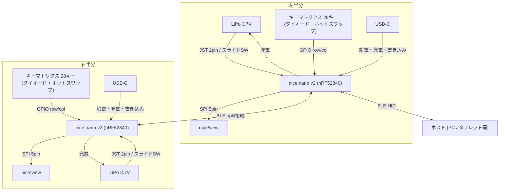

# システム構成(Architecture)

左右分割・完全無線のシステム構成を示す。左右は対称構成(右は物理左右反転)。

## 構成要素

各半分(左・右)がそれぞれ以下を持つ:

- **nice!nano v2**(nRF52840、ソケット実装、USB-C付き)
- **キーマトリクス**(28キー + 全キーにダイオード、ホットスワップソケット)
- **nice!view**(SPI接続、5ピン、ソケット実装、nice!nanoの上に積層)
- **3.7V LiPoバッテリー**(2ピンJSTコネクタ経由、電源スライドスイッチ、リセットボタン)

左右間およびホストとの接続はすべてBluetooth LE。有線の左右接続は存在しない。

## ブロック図



## 役割の考え方

- ZMKのsplit構成では、片側が **central**(ホストとBLE接続し、もう片側の入力を統合)、
  もう片側が **peripheral**(centralへBLEで入力を送る)となる。
- どちらをcentralにするかは未確定(ZMKのデフォルトと消費電力特性を確認して決定。[firmware.md](firmware.md) 参照)。
- ハードウェアは左右対称に設計し、central/peripheralの区別はファームウェア側でのみ行う。

## 電源経路

```
USB-C ─→ nice!nano(充電回路内蔵)─→ LiPo充電
LiPo ─→ JST 2pin ─→ 電源スライドスイッチ ─→ nice!nano(電源入力)
```

- 充電はnice!nano内蔵の充電回路に任せる(外付け充電ICは設けない)。
- スライドスイッチの挿入位置(バッテリー正極ラインを切るのか、nice!nanoの想定するスイッチ端子を使うのか)は
  nice!nanoの公式ピン配置を確認してから確定する([electrical.md](electrical.md) の未確定事項)。

## 責務の分離

| 領域 | ドキュメント | 内容 |
| --- | --- | --- |
| 電気 | [electrical.md](electrical.md) | マトリクス、GPIO、ダイオード、電源、nice!view配線 |
| 機構 | [mechanical.md](mechanical.md) | 積層構造、プレート、ケース、バッテリー配置 |
| ファームウェア | [firmware.md](firmware.md) | ZMK split設定、Shield定義、キーマップ |
